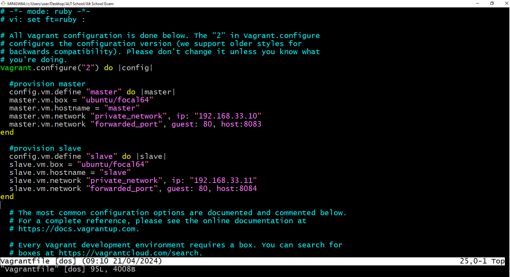
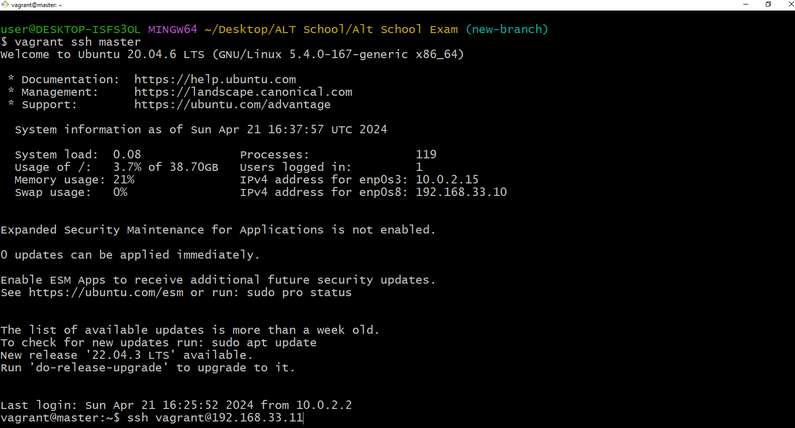
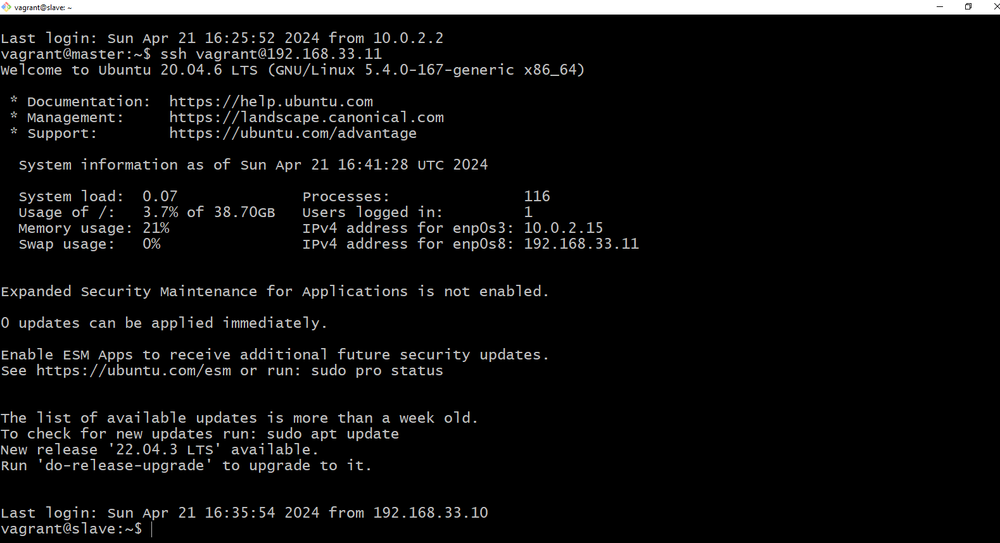
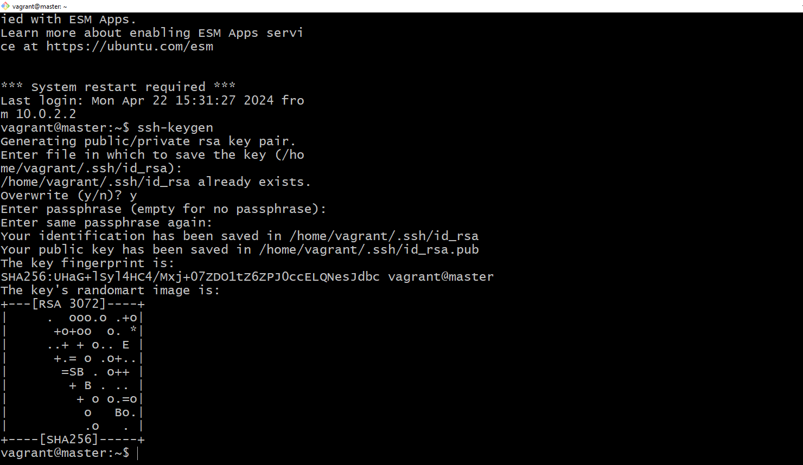
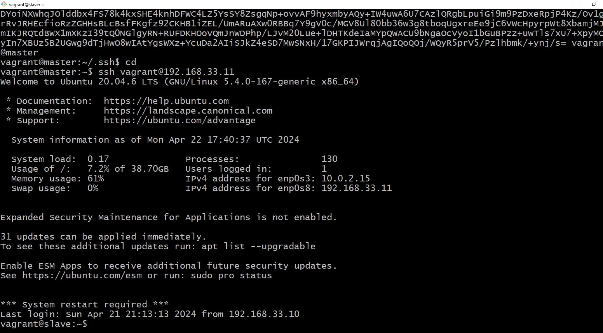
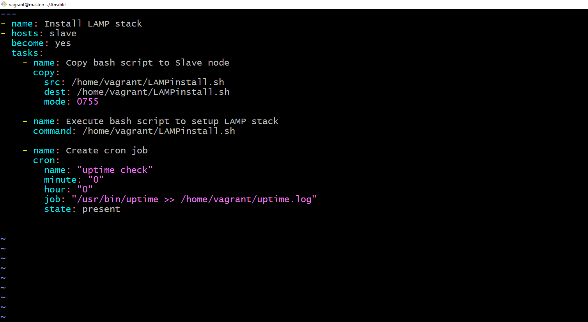

# Task:

## TASK:

### (Deploy LAMP Stack)

#### Objective

Automate the provisioning of two Ubuntu-based servers, named “Master” and “Slave”, using Vagrant.
On the Master node, create a bash script to automate the deployment of a LAMP (Linux, Apache, MySQL, PHP) stack.
This script should clone a PHP application from GitHub, install all necessary packages, and configure Apache web server and MySQL.
Ensure the bash script is reusable and readable.
Using an Ansible playbook: Execute the bash script on the Slave node and verify that the PHP application is accessible through the VM’s IP address (take screenshot of this as evidence) Create a cron job to check the server’s uptime every 12 am.

# Solution

## Documentation of the steps taken to accomplish the above task.

 Master: 192.168.33.10  slave: 192.168.33.11

 ### Set up master and slave VMs:
  
 1. After initializing vagrant(vagrant init), I edited the vagrantfile with the "vi vagrantfile" command, I provisioned both the master and slave machines in one file.
  

2. After setting up the VMs, validate your vagrantfile to check for errors, then run "vagrant up" command. After running vagrant up to start the machines, run vagrant ssh master on one terminal and vagrant ssh slave on another to go into the slave.
  #### Master 
  
  #### Slave
  

### Connect master to slave with ssh keys

1. After creating and going into your machines, it's time to connect both the master and the slave. So first, we'll create an ssh key by doing ssh-keygen , then we copy the key from the id_rsa.pub file and go into the slave into the .ssh folder and copy the key from master to the slave.
2. After copying the key, the both machines should be connected and we can access the slave from the master as shown below.

### Create Inventory and playbook file
1. Use mkdir to create an ansible folder and then use touch inventory playbook.yml to create both the inventory and playbook file

2. Inside your ansible folder update and install ansible using sudo apt update to update and sudo apt install ansible -y to install ansible. 

### Edit inventory file 
1. Fill the inventory file with the appropriate hosts(slave). That can be done using the vi inventory 

### create and write script
After doing all that, i went into my home folder and created a script (lamp.sh) using the command cd ~ to go to the home and vi LAMPinstall.sh to create the script and write it. My script is included in my github documentation.

### edit the playbook file.
After writing the bash script, its time to edit the playbook to run the script on the slave node. We do that using vi playbook.yml.

## Accessing the website
1. After writing and editing the playbook, we access our wesibe using the slave ip address. This is what the screen will look like after the playbook has run successfully 
2. Going to your browser and putting in the ip address of your slave will direct you to this laravel homepage . You can see that the ip address in the picture matches our slave ip address.

Those are the steps taken to set up and install LAMP and running on a slave node from master with a playbook.
 

## Challenges faced during this exercise.
This exam was not without challenges as I faced a number of them in the process of getting the application to be accessible. The challenges helped me get more knowlege of the whole concept that i've learned so far and I was able to apply them to my exam and get it accessible. 

1. The first one was getting it to point to my apache2 website but not to the laravel home.

2. After solving the first problem I had, I ran the playbook and got another challenge, my playbook would just run and not execute with no error message, nothing. I researched and learned that prompts in the installation of those packages would lead too the ansible delaying because it would expext a response. I took a little time and I realized I had to run the commands in a test environment step by step so I can find out where the prompts were and other errors as well. I ran it in a test evnironment(slave2) as seen below and got it, then automated it in my playbook and finally ran it successfully in my ansible playbook 